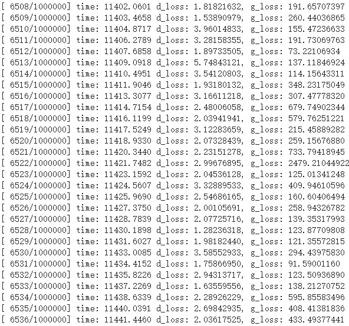
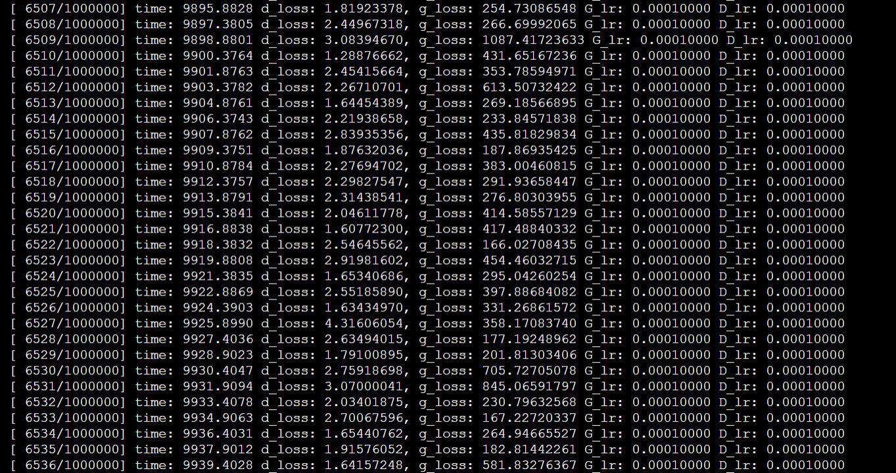

# UGATIT-Paddle

### Unsupervised Generative Attentional Networks with Adaptive Layer-Instance Normalization for Image-to-Image Translation

<div align="center">
  &ensp;&ensp;&ensp;&ensp;&ensp;&ensp;&ensp;&ensp;&ensp;&ensp;&ensp;&ensp;&ensp;&ensp;&ensp;&ensp;
</div>

<div align="center"><font face="楷体" size=4>两幅图左边为原图&ensp;&ensp;&ensp;&ensp;&ensp;&ensp;&ensp;&ensp;&ensp;&ensp;&ensp;&ensp;&ensp;&ensp;&ensp;&ensp;&ensp;&ensp;&ensp;&ensp;&ensp;&ensp;&ensp;右边为生成的图像</font></div>

### [Paper](https://arxiv.org/abs/1907.10830) | [Official Tensorflow code](https://github.com/taki0112/UGATIT)
The results of the paper came from the **Tensorflow code**


> **U-GAT-IT: Unsupervised Generative Attentional Networks with Adaptive Layer-Instance Normalization for Image-to-Image Translation**<br>
>
> **Abstract** *We propose a novel method for unsupervised image-to-image translation, which incorporates a new attention module and a new learnable normalization function in an end-to-end manner. The attention module guides our model to focus on more important regions distinguishing between source and target domains based on the attention map obtained by the auxiliary classifier. Unlike previous attention-based methods which cannot handle the geometric changes between domains, our model can translate both images requiring holistic changes and images requiring large shape changes. Moreover, our new AdaLIN (Adaptive Layer-Instance Normalization) function helps our attention-guided model to flexibly control the amount of change in shape and texture by learned parameters depending on datasets. Experimental results show the superiority of the proposed method compared to the existing state-of-the-art models with a fixed network architecture and hyper-parameters.*

## Usage
```
├── dataset
   └── YOUR_DATASET_NAME
       ├── trainA
           ├── xxx.jpg (name, format doesn't matter)
           ├── yyy.png
           └── ...
       ├── trainB
           ├── zzz.jpg
           ├── www.png
           └── ...
       ├── testA
           ├── aaa.jpg 
           ├── bbb.png
           └── ...
       └── testB
           ├── ccc.jpg 
           ├── ddd.png
           └── ...
```

### Train
```
> python main.py --dataset selfie2anime
```
* If the memory of gpu is **not sufficient**, set `--light` to True

### Resume Train
```
> python main.py --dataset selfie2anime --resume True --start_iter <123456 for example>
```
* If the memory of gpu is **not sufficient**, set `--light` to True

### Test
```
> python main.py --dataset selfie2anime --phase test
```

## 主要贡献
➢实现无监督图像到图像翻译任务，**主要解决两个图像域间纹理和图像差异很大导致图像到图像翻译任务效果不好的问题**
➢实现了**相同网络结构和超参数**同时需要保持图像中目标shape(马到斑马，horse2zebra)的图像翻译任务和需要改变图像shape(猫到狗，cat2dog)的图像任务


## 论文创新
<center><font face="宋体" color=red size=4>无监督图像跨域转换模型，学习两个不同域内映射图像的功能</font></center>

➢提出新的**归一化模块和新的归一化函数AdaLIN**构成一种新的无监督图像到图像的转换方法
➢增加注意力机制**Attention模块**，**增强生成器的生成能力**，更好的区分源域和目标域。**增强判别器的判别能力**，更好的区分生成图像与原始图像


## 论文方法
<center><font face="宋体" color=red size=4>引入新的可学习的归一化方法</font><font face="Times New Roman" color=red size=4>AdaLIN</font></center>

➢LayerNorm更多的考虑输入特征通道之间的相关性，LN比IN风格转换更彻底，但是语义信息保存不足
➢InstanceNorm更多考虑单个特征通道的内容，IN比LN更好的保存原图像的语义信息，但是风格转换不彻底
➢论文中，通过上诉公式，自适应的调整参数来得到更优化的网络模型

<div align="center"><br><font face="楷体" size=4>几种归一化方法示例</font></div>

|方法| 作用 |
|:--|:--|
| BatchNorm | batch方向做归一化，算NHW的均值，对小batchsize效果不好；BN主要缺点是对batchsize的大小比较敏感，由于每次计算均值和方差是在一个batch上，所以如果batchsize太小，则计算的均值、方差不足以代表整个数据分布 |
| LayerNorm | channel方向做归一化，算CHW的均值，主要对RNN作用明显 |
| InstanceNorm | 一个channel内做归一化，算H*W的均值，用在风格化迁移；因为在图像风格化中，生成结果主要依赖于某个图像实例，所以对整个batch归一化不适合图像风格化中，因而对HW做归一化。可以加速模型收敛，并且保持每个图像实例之间的独立 |
| GroupNorm | 将channel方向分group，然后每个group内做归一化，算(C//G)HW的均值；这样与batchsize无关，不受其约束 |
| SwitchableNorm | 是将BatchNorm、LayerNorm、InstanceNorm结合，赋予权重，让网络自己去学习归一化层应该使用什么方法 |


# 实验效果
<div align="center"><br><font face="Times New Roman" size=4>Visual comparisons of the dog2cat with attention features maps. (a) Source images, (b)
Attention map of the generation, (c-d) Local and global attention maps of the discriminators, (e) Our
results, (f) CycleGAN (Zhu et al. (2017)), (g) UNIT (Liu et al. (2017)), (h) MUNIT (Huang et al.
(2018)), (i) DRIT (Lee et al. (2018)), (j) AGGAN (Mejjati et al. (2018)).
</font></div>

<div align="center"><br><font face="Times New Roman" size=4>Visual comparisons of the photo2vangogh with attention features maps. (a) Source
images, (b) Attention map of the generation, (c-d) Local and global attention maps of the discriminators, respectively, (e) Our results, (f) CycleGAN (Zhu et al. (2017)), (g) UNIT (Liu et al. (2017)),
(h) MUNIT (Huang et al. (2018)), (i) DRIT (Lee et al. (2018)), (j) AGGAN (Mejjati et al. (2018)).
</font></div>

<div align="center"><br><font face="Times New Roman" size=4>Visual comparisons of the photo2portrait with attention features maps. (a) Source images,
(b) Attention map of the generator, (c-d) Local and global attention maps of the discriminators,
respectively, (e) Our results,(f) CycleGAN (Zhu et al. (2017)), (g) UNIT (Liu et al. (2017)), (h)
MUNIT (Huang et al. (2018)), (i) DRIT (Lee et al. (2018)), (j) AGGAN (Mejjati et al. (2018)).
</font></div>

# Pytorch 与 Paddle训练效果对比
<div align="center">
  <br>
</div>
左边为Pytorch训练损失，右边为Paddle训练损失（部分）

# 获取更多
更多论文研读信息参见CSDN blog: [DeepHao 【飞桨】GAN：U-GAT-IT【2020 ICLR】论文研读](https://blog.csdn.net/qq_39567427/article/details/107843670)
